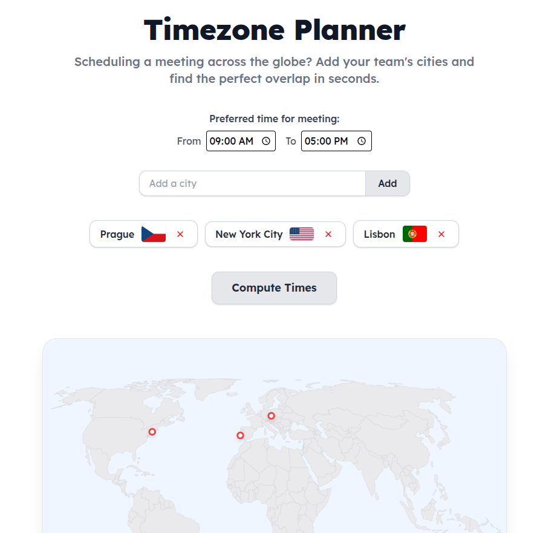
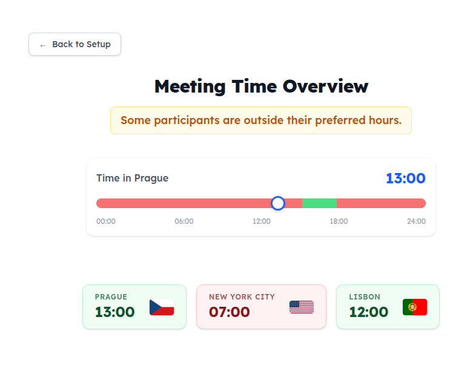

# Timezone Planner

## About
I built this as a personal project for my portfolio because I wanted to create something that people might actually find useful. You can add cities from all over the world along with everyone's local availability, and the app will automatically calculate the exact overlapping times when everyone is free to meet. It also features an interactive slider that visually maps out the local times so you can easily see if they fall into the available slots.

## Live demo
The application is currently hosted on **[Netlify](https://timezone-planner-online.netlify.app/)**.

<table>
  <tr>
    <td>
      
    </td>
    <td>
      
    </td>
  </tr>
</table>


## Tech stack
* **Core:** React 19, TypeScript
* **Build Tool:** Vite
* **Styling:** Tailwind CSS
* **Deployment:** Netlify

## Challenges & Solutions
### 1. Building the Interactive Time Slider
* **The Challenge:** I had a very specific UX vision for a drag-and-drop timeline slider that could visually represent multiple timezones simultaneously and highlight overlapping availability. Building this from scratch involved complex state management and calculating precise width/offset percentages based on time data.
* **The Solution:** Because I knew exactly what I wanted the UI to look and feel like, I used AI to help code the initial prototype based on my specifications. The prototype I got was more or less the version I wanted, so I made only tiny improvements and that was it.

### 2. Accessible Real-Time Search Suggestions
* **The Challenge:** When users search for a city, they expect a fast, seamless dropdown experience. I wanted to build an auto-complete feature that was fully navigable by keyboard (not just mouse clicks), without overcomplicating the architecture behind it.
* **The Solution:** For maximum speed and simplicity, I decided to use a ``cities.json`` data package so the app wouldn't have to wait on API calls for every keystroke. Making the dropdown accessible actually turned out to be easier than I initially thought - I just managed the active state by combining onKeyDown handlers for the arrow keys and onMouseEnter for mouse tracking.

### 3. Calculating Time Across Timezones
* **The Challenge:** Naturally, the biggest technical hurdle in a timezone app is accurately converting and managing the actual time math without edge-case bugs.

* **The Solution:** I decided not to reinvent the wheel here and brought in two reliable libraries. I used ``tz-lookup`` to correctly format and grab the specific timezone strings, and then passed that data into ``luxon`` to handle all the actual time conversions and formatting flawlessly.


## Installation
1. Clone the repository
```bash
git clone https://github.com/kopeclu/timezone-planner.git
```

2. Navigate to the repository
```bash
cd timezone-planner
```

3. Install dependencies
```bash
npm i
```

4. Run locally
```bash
npm run dev
```
